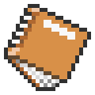

<!-- PROJECT SHIELDS -->
<!--
*** I'm using markdown "reference style" links for readability.
*** Reference links are enclosed in brackets [ ] instead of parentheses ( ).
*** See the bottom of this document for the declaration of the reference variables
*** for contributors-url, forks-url, etc. This is an optional, concise syntax you may use.
*** https://www.markdownguide.org/basic-syntax/#reference-style-links
-->
[![Contributors][contributors-shield]][contributors-url]
[![Forks][forks-shield]][forks-url]
[![Stargazers][stars-shield]][stars-url]
<!--
-->

<!-- PROJECT LOGO -->
 

  

<h3 align="center">Unofficial PokéOne Guide</h3>

  

    The Unofficial PokéOne Guide serves you all the information you need for a successful gameplay.
     
     
    <i>A brief overview of topics is given here, refer to the docs/wiki for more details</i> 
    <a href="https://github.com/Finrod-Amandil/PokeOneWeb/wiki"><strong>Explore the docs »</strong></a>
     
     
  

<strong>Try it out yourself at <a href="https://stage.pokeone.guide/">https://stage.pokeone.guide/</a>!</strong>

## Features
- All Pokémon spawns and Items found in every location of PokéOne - including events!
- Extensive filter and sort toolbox for finding the perfect Pokémon for your needs.
- Detailed information about every Pokémon, all spawns, learnable moves, and a fancy stat configurator.
- List and details about every item in the game.
and many more to come...

## Getting Started

To get a local copy up and running follow these steps:
1. Install Visual Studio 2022 with the ASP.NET and Web Development workload ([Download](https://visualstudio.microsoft.com/)).
2. Install Visual Studio Code ([Download](https://visualstudio.microsoft.com/)) and the latest version of Node.js ([Download](https://nodejs.org/)).
3. Install SQL Server Express ([Download](https://www.microsoft.com/en-us/sql-server/sql-server-downloads)).
4. Clone this repository using the git client of your choice.
5. Open the `PokeOneWeb.sln` file using Visual Studio 2022.
6. Generate the database by typing `update-database` in the Package Manager Console in Visual Studio 2022.
7. Set the project "PokeOneWeb.DataSync" as Startup project.
8. Run the application to download the latest data and generate JSON files.
9. Copy the generated JSON files from `PokeOneWeb.DataSync\bin\Debug\net6.0\resources` to `PokeOneWeb\Frontend\pokeoneweb\src\assets\resources`.
10. Open the `PokeOneWeb/Frontend/pokeoneweb` folder in Visual Studio Code.
11. Install the angular-cli: `npm install -g @angular/cli`.
12. Install dependencies: `npm install`.
13. Run the application: `ng serve`.
14. Open the application at `http://localhost:4200/`

## Deployment of the application
Continuous integration and deployment of the application is done using GitHub Actions.

On every push, the project will be built and tests will be run inside the build pipeline. The outcome can be shown in the Github Actions tab on [github.com](https://github.com/Finrod-Amandil/PokeOneWeb/actions).

On pushes to the `development` branch (eg. via Pull-Request), the application will be compiled and packaged.

After that, the package is uploaded to the hosting machine and deployed to the development environment.

### Environments
| Environment        | URL           | Status  |
| ------------- |-------------| -----|
| Dev      | [https://dev.pokeone.guide](https://dev.pokeone.guide) |  |
| Stage      | [https://stage.pokeone.guide](https://stage.pokeone.guide) |  |
| Prod | [https://pokeone.guide](https://pokeone.guide)    | Coming soon |

## Built With
The application is built with the following libraries and frameworks.

* [Angular 13](https://angular.io/)
* [.NET 6](https://dotnet.microsoft.com/en-us/)

<!-- MARKDOWN LINKS & IMAGES -->
<!-- https://www.markdownguide.org/basic-syntax/#reference-style-links -->
[contributors-shield]: https://img.shields.io/github/contributors/Finrod-Amandil/PokeOneWeb.svg
[contributors-url]: https://github.com/Finrod-Amandil/PokeOneWeb/graphs/contributors
[forks-shield]: https://img.shields.io/github/forks/Finrod-Amandil/PokeOneWeb.svg
[forks-url]: https://github.com/Finrod-Amandil/PokeOneWeb/network/members
[stars-shield]: https://img.shields.io/github/stars/Finrod-Amandil/PokeOneWeb.svg
[stars-url]: https://github.com/Finrod-Amandil/PokeOneWeb/stargazers
